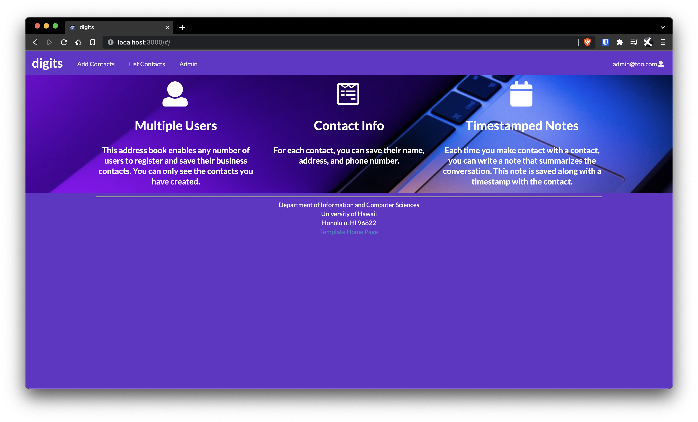
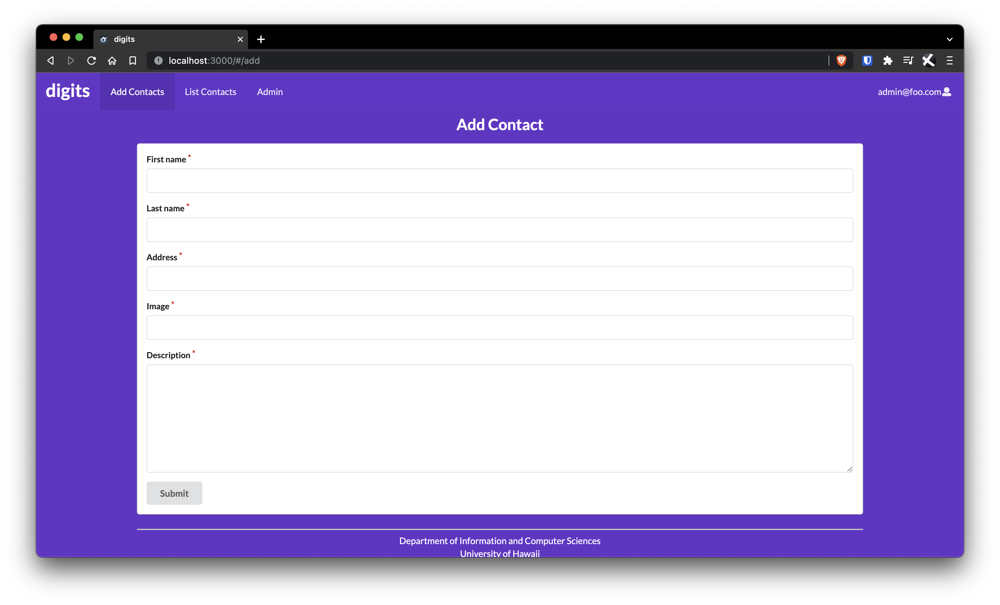
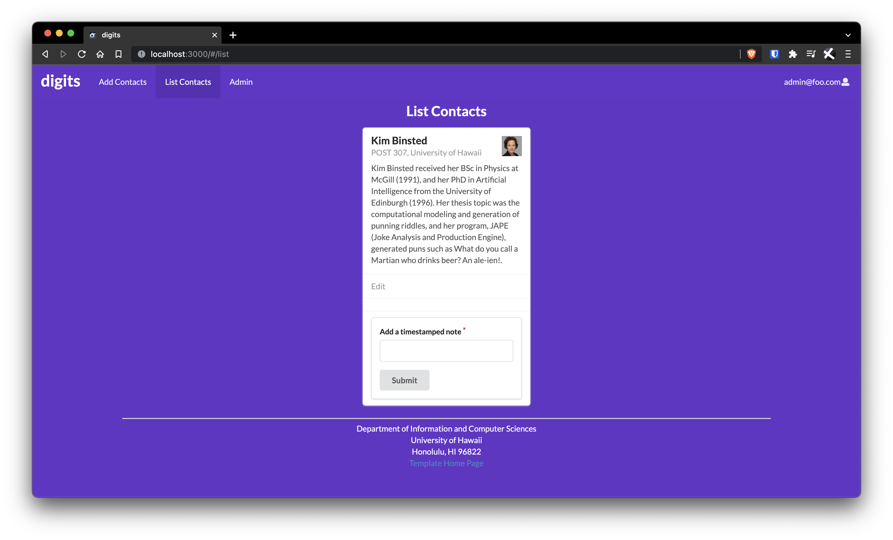
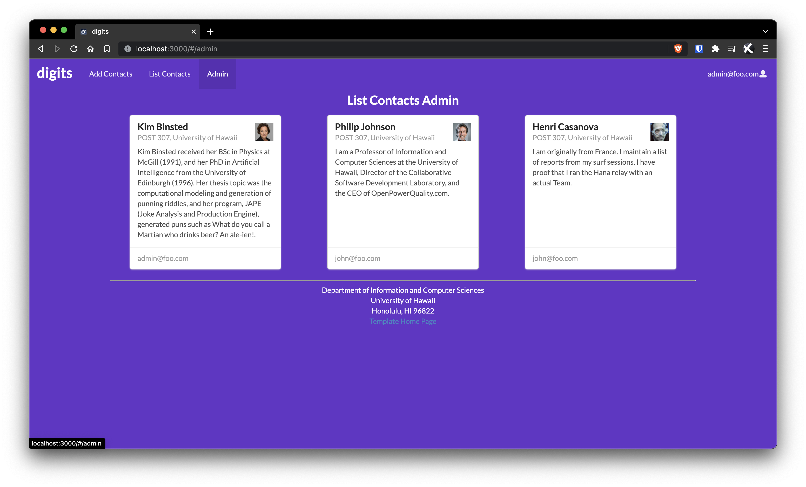

Digits is an application that allows users to:

Register an account, create and manage a set of contacts, and add a set of timestamped notes regarding their interactions with each contact.

The Add Contacts page allows for users to add a contact's name, address, profile photo link, and bio in a form.

List Contacts page allows the user to view all the contacts in the user's account. They may also edit the contact info or add timestamped notes about the account. 

The Admin list allows a user with admin privileges to easily see all contacts across the database. 

